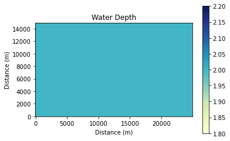
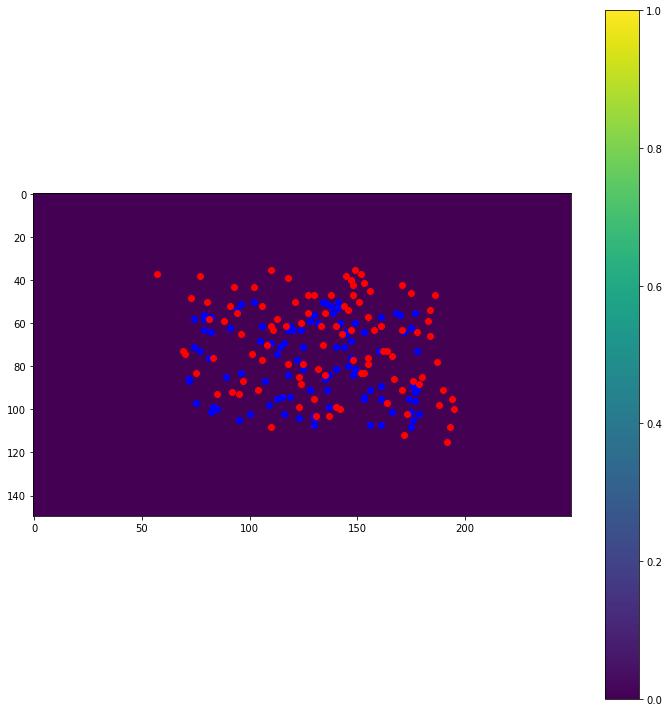
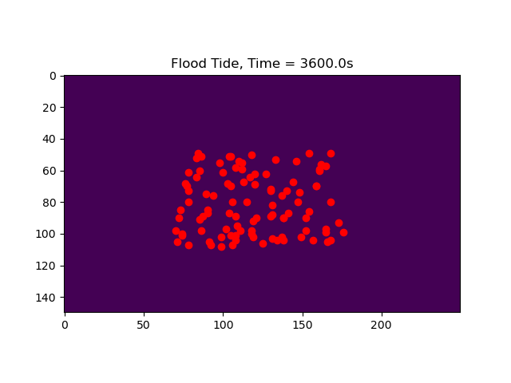

Tides on a simple 2D field
--------------------------

In this notebook we will be running the
`Landlab <http://landlab.github.io/>`__ tidal-flow-calculator over a
simple 2D field of constant depth and roughness. The domain used is a
modified version of one of the examples from `this
notebook <https://github.com/landlab/landlab/blob/gt/tidal-flow-component/notebooks/tutorials/tidal_flow/tidal_flow_calculator.ipynb>`__.

Importing and Installing
~~~~~~~~~~~~~~~~~~~~~~~~

First we will import some standard scientific Python libraries

.. code:: ipython3

    import matplotlib.pyplot as plt
    import numpy as np

Next we need to install some libraries (including Landlab) to properly
accomplish this task.

As of this writing (8/18/2020) the tidal-flow-calculator is not part of
the core Landlab installation. As a consequence, we need to checkout the
feature branch containing the tidal-flow-calculator component
(https://github.com/landlab/landlab/tree/gt/tidal-flow-component). After
checking out or cloning this branch locally, ``python setup.py install``
should be run to build a new landlab installation containing the
tidal-flow-calculator.

To simulate passive particle transport we will use the Lagrangian-based
transport model `dorado <https://github.com/passaH2O/dorado>`__. We can
install dorado by typing ``pip install pydorado`` from the command
line.

.. code:: ipython3

    from landlab.components import TidalFlowCalculator
    from landlab import RasterModelGrid
    from dorado.routines import plot_state

Lastly there are some custom scripts containing functions we want to use
for this example. These scripts are available in the same directory as
this notebook, and so our imports will be happening locally.

.. code:: ipython3

    from map_fun import gridded_vars
    from plot_fun import group_plot
    from plot_fun import plot_depth
    from particletransport import init_particles
    from particletransport import tidal_particles

Model Parameters
~~~~~~~~~~~~~~~~

We are going to create model parameters that define the tidal scenario
for the tidal-flow-calculator as well as the random field properties.

First we will define the size of the domain (which is going to be a
rectangle) as well as the grid spacing, mean water depth, and properties
associated with the tide. In this 2D domain, the left and bottom
boundaries are closed.

.. code:: ipython3

    nrows = 150
    ncols = 250
    grid_spacing = 100.0  # m
    mean_depth = 2.0  # m
    tidal_range = 2.0  # m
    roughness = 0.01  # s/m^1/3, i.e., Manning's n
    tide_period = 1*60  # tidal period in seconds
    n_tide_periods = 15  # number of tidal periods to move particles around for

Defining the Landlab Grid
~~~~~~~~~~~~~~~~~~~~~~~~~

Next we are going to be defining the Landlab grid object and its
associated parameters. Here the depth will be constant.

.. code:: ipython3

    # create and set up the grid
    grid = RasterModelGrid((nrows, ncols), xy_spacing=grid_spacing)
    z = grid.add_zeros('topographic__elevation', at='node')
    z[:] = -mean_depth
    grid.set_closed_boundaries_at_grid_edges(False, False, True, True)

Instantiate the TidalFlowCalculator and run it
~~~~~~~~~~~~~~~~~~~~~~~~~~~~~~~~~~~~~~~~~~~~~~

.. code:: ipython3

    # instantiate the TidalFlowCalculator
    tfc = TidalFlowCalculator(grid, tidal_range=tidal_range,
                              tidal_period=tide_period, roughness=roughness)

    # run it
    tfc.run_one_step()

Initialize the particles and run them
~~~~~~~~~~~~~~~~~~~~~~~~~~~~~~~~~~~~~

Here we will specify where we want the particles to be initially placed
and the number of particles to use. Then we will allow them to move with
the tides.

.. code:: ipython3

    # get gridded values
    gvals = gridded_vars(grid)

    # initialize the particle parameters
    seed_xloc = list(range(70, 180))
    seed_yloc = list(range(50, 110))
    Np_tracer = 100  # use 100 particles
    params = init_particles(seed_xloc, seed_yloc, Np_tracer, grid_spacing, gvals)

.. code:: ipython3

    %%capture
    # move the particles with the tides
    walk_data = tidal_particles(params, tide_period/10, n_tide_periods)

Make visualizations
~~~~~~~~~~~~~~~~~~~

First we will visualize the domain, then the velocity components of the
ebb and flood tides. Afterwards we will plot the particle locations at
beginning and end of the simulation.

.. code:: ipython3

    # visualize the domain
    plot_depth(grid)
    plt.title('Water Depth')
    plt.show()

.. code:: ipython3

    # plot velocity information
    group_plot(gvals)
    plt.show()

.. image:: output_19_0.png

.. code:: ipython3

    # plot particle locations on the roughness field
    plt.figure(figsize=(10, 10))
    # first plot initial locations as blue dots
    plot_state(np.flipud(np.reshape(z,grid.shape)),
               walk_data, iteration=0, target_time=None, c='b')
    # then plot final locations as red dots
    plot_state(np.flipud(np.reshape(z,grid.shape)),
               walk_data, iteration=-1, target_time=None, c='r')
    # make the colorbar - yellow for high roughness, purple for low
    plt.colorbar()
    # tighten layout
    plt.tight_layout()
    # show it
    plt.show()

Animated Results
~~~~~~~~~~~~~~~~

While the above still image is nice, it does not totally reflect how the
tides have influence the movement of the passive tracers. A better way
of visualizing this is by animating the movement of the particles at
each ebb and flood tide:

   simple_2d_gif

With this visual we can see the oscillatory nature of the flow field and
the way in which the particles move with the tides.
