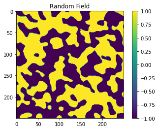
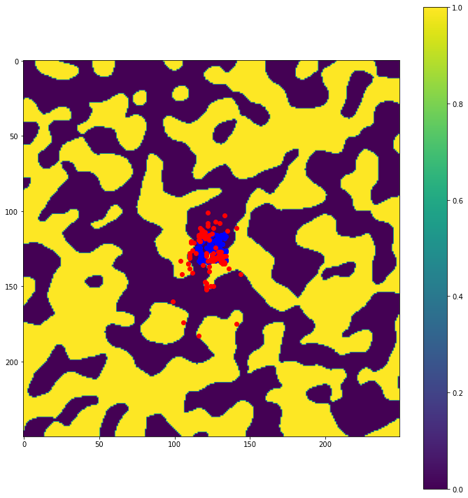

Tides on a randomly vegetated field
-----------------------------------

In this notebook we will be running the
`Landlab <https://landlab.github.io/>`__ tidal-flow-calculator over a
randomly generated field of vegetation (simulated by 2 Mannings
Roughness values) and looking at how passive particle transport is
impacted by the spatial distribution of plants.

Importing and Installing
~~~~~~~~~~~~~~~~~~~~~~~~

First we will import some standard scientific Python libraries

.. code:: ipython3

    import matplotlib.pyplot as plt
    import numpy as np

Next we need to install some libraries (including Landlab) to properly
accomplish this task.

As of this writing (8/18/2020) the tidal-flow-calculator is not part of
the core Landlab installation. As a consequence, we need to checkout the
feature branch containing the tidal-flow-calculator component
(https://github.com/landlab/landlab/tree/gt/tidal-flow-component). After
checking out or cloning this branch locally, ``python setup.py install``
should be run to build a new landlab installation containing the
tidal-flow-calculator.

To build random fields of different characteristic length scales, we
will use the geostatistical toolbox
`GSTools <https://geostat-framework.github.io/>`__. To install
this package, the command ``conda install gstools`` can be run from the
command line. In this example we will be using a standard covariance
model for random field generation.

Lastly, to simulate passive particle transport we will use the
Lagrangian-based transport model
`dorado <https://passah2o.github.io/dorado/>`__. To install dorado we
can type ``pip install pydorado`` from the command line.

.. code:: ipython3

    from landlab.components import TidalFlowCalculator
    from landlab import RasterModelGrid
    from landlab.grid.mappers import map_max_of_link_nodes_to_link
    from dorado.routines import plot_state
    import gstools as gs

Lastly there are some custom scripts containing functions we want to use
for this example. These scripts are available in the same directory as
this notebook, and so our imports will be happening locally.

.. code:: ipython3

    from map_fun import gridded_vars
    from plot_fun import group_plot
    from plot_fun import plot_depth
    from particletransport import init_particles
    from particletransport import tidal_particles

Model Parameters
~~~~~~~~~~~~~~~~

We are going to create model parameters that define the tidal scenario
for the tidal-flow-calculator as well as the random field properties.

First we will define the size of the domain (which is going to be a
square) as well as the grid spacing, mean water depth, and properties
associated with the tide. Two roughness values are going to be
specified, a low and high roughness to represent low and high vegetation
density.

.. code:: ipython3

    nrows = 250
    ncols = nrows
    grid_spacing = 1.0  # m
    mean_depth = 1.5  # m
    tidal_range = 0.5  # m
    roughness_low = 0.01  # s/m^1/3, i.e., Manning's n
    roughness_high = 0.1  # s/m^1/3, i.e., Manning's n
    tide_period = 2*60*60  # tidal period in seconds
    n_tide_periods = 10  # number of tidal periods to move particles around for
    Np_tracer = 100 # number of passive particles to use

We also need to define properties of the random field. The two values of
importance here are the ``seed`` which defines the random seed that is
used (can be nice for reproducability) and the value ``len_scale`` which
specifies the length scale of the features. ``len_scale`` is an integer
for an isotropic field, but can be a list (e.g. ``[5, 10]``) to create
an anisotropic field.

.. code:: ipython3

    seed = 1  # defines the random seed
    len_scale = 10  # length scale - integer = isotropic; list [1, 5] = anisotropic

Generating a random field
~~~~~~~~~~~~~~~~~~~~~~~~~

Now we will be generating a random field based on the ``seed`` and
``len_scale`` parameters defined above.

.. code:: ipython3

    x = y = range(nrows)
    model = gs.Gaussian(dim=2, var=1, len_scale=len_scale)
    srf = gs.SRF(model, seed=seed)
    srf.structured([x, y])
    gs.transform.binary(srf)
    # get array info from srf object
    srf_array = srf.field

.. code:: ipython3

    # Let's visualize this random field
    plt.figure()
    plt.imshow(srf_array)
    plt.colorbar()
    plt.title('Random Field')
    plt.show()

Defining the Landlab Grid
~~~~~~~~~~~~~~~~~~~~~~~~~

Next we are going to be defining the Landlab grid object and its
associated parameters. This is where we will be passing in the roughness
values as dictated by the random field. In areas where the random field
values exceed 0, the roughness will be high, and in areas where the
random field values are negative the roughness will be low.

*Note:* We are defining a domain in which the top and bottom boundaries
are open and the left and right boundaries are closed. You can modify
this by changing the True/False values!

.. code:: ipython3

    # create and set up the grid
    grid = RasterModelGrid((nrows, ncols), xy_spacing=grid_spacing)
    z = grid.add_zeros('topographic__elevation', at='node')
    grid.set_closed_boundaries_at_grid_edges(True, False, True, False)

    # set up roughness field (calculate on nodes, then map to links)
    roughness_at_nodes = np.zeros_like(z)
    roughness_at_nodes[srf_array.flatten() > 0] = roughness_high  # high roughness
    roughness_at_nodes[srf_array.flatten() < 0] = roughness_low  # low roughness
    roughness = grid.add_zeros('roughness', at='link')
    map_max_of_link_nodes_to_link(grid, roughness_at_nodes, out=roughness)

.. parsed-literal::

    array([ 0.01,  0.01,  0.01, ...,  0.01,  0.01,  0.01])

Instantiate the TidalFlowCalculator and run it
~~~~~~~~~~~~~~~~~~~~~~~~~~~~~~~~~~~~~~~~~~~~~~

.. code:: ipython3

    # instantiate the TidalFlowCalculator
    tfc = TidalFlowCalculator(grid, tidal_range=tidal_range,
                              tidal_period=tide_period, roughness='roughness')

    # run it
    tfc.run_one_step()

Initialize the particles and run them
~~~~~~~~~~~~~~~~~~~~~~~~~~~~~~~~~~~~~

.. code:: ipython3

    # get gridded values
    gvals = gridded_vars(grid)

    # initialize the particle parameters
    # particles will be placed in center of domain
    center_region = list(range(int(nrows/2-10), int(nrows/2+10)))
    seed_xloc = center_region
    seed_yloc = center_region
    params = init_particles(seed_xloc, seed_yloc, Np_tracer, grid_spacing, gvals)

.. code:: ipython3

    %%capture
    # move the particles with the tides
    walk_data = tidal_particles(params, tide_period/10, n_tide_periods,
                                plot_grid=np.flipud(np.reshape(roughness_at_nodes,
                                                               grid.shape)))

Make visualizations
~~~~~~~~~~~~~~~~~~~

First we will visualize the velocity components of the ebb and flood
tides. Then we will plot the particle locations at beginning and end of
the simulation.

.. code:: ipython3

    # plot velocity information
    group_plot(gvals)
    plt.show()

.. image:: output_23_0.png

.. code:: ipython3

    # plot particle locations on the roughness field
    plt.figure(figsize=(10, 10))
    # first plot initial locations as blue dots
    plot_state(np.flipud(np.reshape(roughness_at_nodes,grid.shape)),
               walk_data, iteration=0, target_time=None, c='b')
    # then plot final locations as red dots
    plot_state(np.flipud(np.reshape(roughness_at_nodes,grid.shape)),
               walk_data, iteration=-1, target_time=None, c='r')
    # make the colorbar - yellow for high roughness, purple for low
    plt.colorbar()
    # tighten layout
    plt.tight_layout()
    # show it
    plt.show()

Other Outpus, Gifs and More
~~~~~~~~~~~~~~~~~~~~~~~~~~~

In this example we only ran the module for 10 tidal cycles. If instead
we ran it for 50 tidal cycles and captured the particle position after
each ebb/flood tide, we could create the following video:

.. figure:: ../imgs/random_field/demo_len_scale_10.gif
   :alt: 50_Tidal_Cycles_gif

   50_Tidal_Cycles_gif

We can also examine cases where the length scale of the features in the
random field is changed, if we reduce the feature size then the
particles are impeded less often and can travel further. Let’s take a
look at what happens when the feature length scale is reduced from
``len_scale=10`` to ``len_scale=5``:

.. figure:: ../imgs/random_field/demo_len_scale_05.gif
   :alt: len_scale_05_gif

   len_scale_05_gif

Now we can see that some particles make it to the edge of the domain,
where we might say they ‘leave’ the area of study. This is a quick and
dirty demonstration of how the spatial locations and spread of
vegetation impacts the transport of nutrients and materials under the
imposition of tidal flows.
