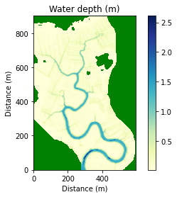
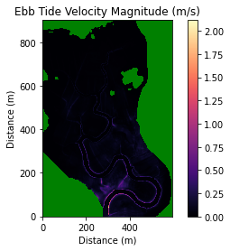
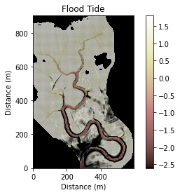
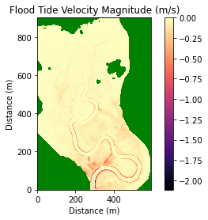
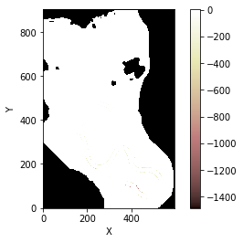
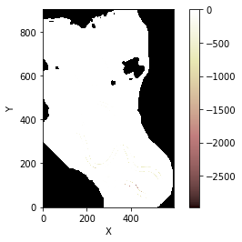

Sediment erosion and Transport 
===================================

In this notebook we implement the erosion and sediment transport
components of the matlab model (Mariotti and Murshid, 2018) in the
existing landlab tidal flow version.

Importing and Installing
------------------------

First we will import some standard scientific Python libraries

.. code:: ipython3

    import numpy as np
    import matplotlib.pyplot as plt

Next we need to install some Landlab libraries to properly accomplish
this task

As of this writing (8/18/2020) the tidal-flow-calculator is not part of
the core Landlab installation. As a consequence, we need to checkout the
feature branch containing the tidal-flow-calculator component
(https://github.com/landlab/landlab/tree/gt/tidal-flow-component). After
checking out or cloning this branch locally, python setup.py install
should be run to build a new landlab installation containing the
tidal-flow-calculator.

We convert the matlab fuctions (totalsedimenterosionMUDsine.m and
sedtran.m) from Mariotti and Murshid ( 2018) to python
(tidal_erosion_calculator) to calculate total sediment erosion.

.. code:: ipython3

    from landlab.grid.mappers import map_link_vector_components_to_node
    from landlab import RasterModelGrid, imshow_grid
    from landlab.components import TidalFlowCalculator
    from landlab.grid.mappers import map_max_of_link_nodes_to_link
    from landlab.io import read_esri_ascii
    import tidal_erosion_calculator as tec

Set parameters
--------------

.. code:: ipython3

    #This set-up is from the MarshMorpho2D source code
    tidal_period = 12.5 * 3600.0  # tidal period in seconds
    tidal_range = 3.1  # tidal range in meters
    roughness_w = 0.02  # Manning's n water
    roughness_v = 0.2 #manning's n for veg
    mean_sea_level = 0.0  # mean sea level in meters
    mwd = 0.01  # minimum depth for water on areas higher than low tide water surface, meters
    nodata_code = 999  # code for a DEM cell with no valid data

Read the DEM to create a grid and topography field
~~~~~~~~~~~~~~~~~~~~~~~~~~~~~~~~~~~~~~~~~~~~~~~~~~

The zSW3.asc dataset can be found at:
https://raw.githubusercontent.com/landlab/landlab/gt/tidal-flow-component/notebooks/tutorials/tidal_flow/zSW3.asc

.. code:: ipython3

    (grid, z) = read_esri_ascii('/Users/ningjiehu/zSW3.asc.txt', name='topographic__elevation')

Create vegetation grid
~~~~~~~~~~~~~~~~~~~~~~

.. code:: ipython3

    veg = grid.add_zeros('vegetation',at='node');
    veg[z<0] = 1;
    veg_atlink = grid.map_max_of_link_nodes_to_link('vegetation')
    grid.add_field('veg_atlink',veg_atlink,at='link')

.. parsed-literal::

    array([ 0.,  0.,  0., ...,  0.,  0.,  0.])

Configure boundaries
~~~~~~~~~~~~~~~~~~~~

The boundaries contains any nodata nodes, plus any nodes higher than
mean high tide

.. code:: ipython3

    grid.status_at_node[z==nodata_code] = grid.BC_NODE_IS_CLOSED
    grid.status_at_node[z>1.8] = grid.BC_NODE_IS_CLOSED
    boundaries_above_msl = np.logical_and(grid.status_at_node==grid.BC_NODE_IS_FIXED_VALUE, z > 0.0)
    grid.status_at_node[boundaries_above_msl] = grid.BC_NODE_IS_CLOSED
    
    print('pre tfc:')
    print(grid.at_node.keys())
    print(grid.at_link.keys())

.. parsed-literal::

    pre tfc:
    ['topographic__elevation', 'vegetation']
    ['veg_atlink']

Generate variable rougness as field in grid
~~~~~~~~~~~~~~~~~~~~~~~~~~~~~~~~~~~~~~~~~~~

.. code:: ipython3

    roughness_at_nodes = roughness_w + np.zeros(z.size)
    roughness_at_nodes[z < 0.0] = roughness_v #or roughness_at_nodes[veg] = roughness_v
    roughness = grid.add_zeros('roughness', at='link')
    map_max_of_link_nodes_to_link(grid, roughness_at_nodes, out=roughness)

.. parsed-literal::

    array([ 0.02,  0.02,  0.02, ...,  0.02,  0.02,  0.02])

Instantiate a TidalFlowCalculator component
-------------------------------------------

.. code:: ipython3

    tfc = TidalFlowCalculator(
            grid,
            tidal_period=tidal_period,
            tidal_range=tidal_range,
            roughness='roughness',
            mean_sea_level=mean_sea_level,
            min_water_depth=mwd,
    )

Assign critical shear stress (?)
~~~~~~~~~~~~~~~~~~~~~~~~~~~~~~~~

.. code:: ipython3

    tau_cr = 0.2 #Critical stress for unvegetated areas
    tau_crv = 0.5  #Critical stress for vegetated areas

.. code:: ipython3

    v = grid.at_link['veg_atlink']
    tec.populateGrids(grid,tfc,tau_cr,tau_crv,v)
    print(grid.at_cell.keys())
    print(grid.at_node.keys())

.. parsed-literal::

    ['tidal_innundation_rate_cell', 'effective_water_depth_cell', 'topographic_elevation_cell', 'hydroperiod_cell', 'water_depth_at_MHW_cell', 'lev_at_cell', 'tau_cr_cell', 'ebb_tide_flow__velocity_cell', 'flood_tide_flow__velocity_cell', 'roughness_cell', 'water_depth_at_cell']
    ['topographic__elevation', 'vegetation', 'mean_water__depth', 'tidal_innundation_rate', 'effective_water_depth', 'hydroperiod', 'water_depth_at_MHW', 'lev_at_node', 'tau_cr_node', 'ebb_tide_flow__velocity_node', 'flood_tide_flow__velocity_node', 'roughness_node', 'water_depth_at_node']

Plot tidal flow
~~~~~~~~~~~~~~~

.. code:: ipython3

    tec.plot_tidal_flow(grid)

.. parsed-literal::

    /Users/ningjiehu/landlab/landlab/plot/imshow.py:267: MatplotlibDeprecationWarning: You are modifying the state of a globally registered colormap. In future versions, you will not be able to modify a registered colormap in-place. To remove this warning, you can make a copy of the colormap first. cmap = copy.copy(mpl.cm.get_cmap("YlGnBu"))
      cmap.set_bad(color=color_for_closed)
    /Users/ningjiehu/landlab/landlab/plot/imshow.py:307: MatplotlibDeprecationWarning: The 'norm' parameter to Colorbar has no effect because it is overridden by the mappable; it is deprecated since 3.3 and will be removed two minor releases later.
      cb = plt.colorbar(norm=norm, shrink=shrink)
    /Users/ningjiehu/landlab/landlab/plot/imshow.py:267: MatplotlibDeprecationWarning: You are modifying the state of a globally registered colormap. In future versions, you will not be able to modify a registered colormap in-place. To remove this warning, you can make a copy of the colormap first. cmap = copy.copy(mpl.cm.get_cmap("pink"))
      cmap.set_bad(color=color_for_closed)
    /Users/ningjiehu/landlab/landlab/plot/imshow.py:267: MatplotlibDeprecationWarning: You are modifying the state of a globally registered colormap. In future versions, you will not be able to modify a registered colormap in-place. To remove this warning, you can make a copy of the colormap first. cmap = copy.copy(mpl.cm.get_cmap("magma"))
      cmap.set_bad(color=color_for_closed)

Consider erosion
----------------

Set mud erodability
~~~~~~~~~~~~~~~~~~~

.. code:: ipython3

    mud_erodability = (10**-5)*24*3600;  # mud erodability kg/m2/day!!!

.. code:: ipython3

    ero = tec.totalsedimenterosion_mudsine(grid, mud_erodability)
    #ok so for some reason erosion value is SUPER high -- no clue why...need to clear that up!

.. code:: ipython3

    for i in range(2):
        ero = tec.totalsedimenterosion_mudsine(grid, mud_erodability)
        z = grid.at_node['topographic__elevation']
        z -= ero
        tfc.run_one_step()
        plt.figure()
        imshow_grid(grid,grid.at_node['topographic__elevation'])
        

