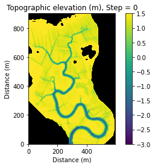
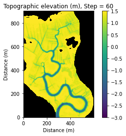
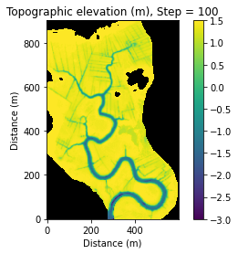
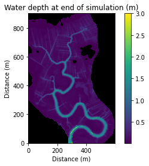
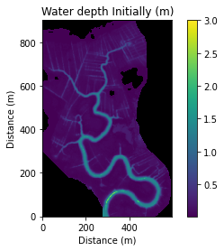

Sediment Erosion
================

In this notebook we implement the erosion components of the matlab model
(Mariotti and Murshid, 2018) in the existing landlab tidal flow version.

Importing and Installing
------------------------

First we will import some standard scientific Python libraries

.. code:: ipython3

    import numpy as np
    import matplotlib.pyplot as plt

Next we need to install some Landlab libraries to properly accomplish
this task

As of this writing (8/18/2020) the tidal-flow-calculator is not part of
the core Landlab installation. As a consequence, we need to checkout the
feature branch containing the tidal-flow-calculator component
(https://github.com/landlab/landlab/tree/gt/tidal-flow-component). After
checking out or cloning this branch locally, python setup.py install
should be run to build a new landlab installation containing the
tidal-flow-calculator.

We convert the matlab fuctions (totalsedimenterosionMUDsine.m) from
Mariotti and Murshid ( 2018) to python (tidal_erosion_calculator) to
calculate total sediment erosion.

.. code:: ipython3

    from landlab.grid.mappers import map_link_vector_components_to_node
    from landlab import RasterModelGrid, imshow_grid
    from landlab.components import TidalFlowCalculator
    from landlab.grid.mappers import map_max_of_link_nodes_to_link
    from landlab.io import read_esri_ascii
    import tidal_erosion_calculator as tec

Set parameters
--------------

.. code:: ipython3

    #This set-up is from the MarshMorpho2D source code
    tidal_period = 12.5 * 3600.0  # tidal period in seconds
    tidal_range = 3.1  # tidal range in meters
    roughness_w = 0.02  # Manning's n water
    roughness_v = 0.2 #manning's n for veg
    mean_sea_level = 0.0  # mean sea level in meters
    mwd = 0.01  # minimum depth for water on areas higher than low tide water surface, meters
    nodata_code = 999  # code for a DEM cell with no valid data
    tcrgradeint = 0.2; # linear increase in tcr below MLW [pa/m]; not used in current version

Read the DEM to create a grid and topography field
~~~~~~~~~~~~~~~~~~~~~~~~~~~~~~~~~~~~~~~~~~~~~~~~~~

The zSW3.asc dataset can be found at:
https://raw.githubusercontent.com/landlab/landlab/gt/tidal-flow-component/notebooks/tutorials/tidal_flow/zSW3.asc
or the CostalTeam github repository.

.. code:: ipython3

    (grid, z) = read_esri_ascii('/Users/ningjiehu/zSW3.asc.txt', name='topographic__elevation')

Create vegetation grid
~~~~~~~~~~~~~~~~~~~~~~

.. code:: ipython3

    veg = grid.add_zeros('vegetation',at='node');
    veg[z<0] = 1;
    veg_atlink = grid.map_max_of_link_nodes_to_link('vegetation')
    grid.add_field('veg_atlink',veg_atlink,at='link')

.. parsed-literal::

    array([ 0.,  0.,  0., ...,  0.,  0.,  0.])

Configure boundaries
~~~~~~~~~~~~~~~~~~~~

The boundaries contains any nodata nodes, plus any nodes higher than
mean high tide

.. code:: ipython3

    grid.status_at_node[z==nodata_code] = grid.BC_NODE_IS_CLOSED
    grid.status_at_node[z>1.8] = grid.BC_NODE_IS_CLOSED
    boundaries_above_msl = np.logical_and(grid.status_at_node==grid.BC_NODE_IS_FIXED_VALUE, z > 0.0)
    grid.status_at_node[boundaries_above_msl] = grid.BC_NODE_IS_CLOSED
    
    print('pre tfc:')
    print(grid.at_node.keys())
    print(grid.at_link.keys())

.. parsed-literal::

    pre tfc:
    ['topographic__elevation', 'vegetation']
    ['veg_atlink']

Generate variable rougness as field in grid
~~~~~~~~~~~~~~~~~~~~~~~~~~~~~~~~~~~~~~~~~~~

.. code:: ipython3

    roughness_at_nodes = roughness_w + np.zeros(z.size)
    roughness_at_nodes[z < 0.0] = roughness_v #or roughness_at_nodes[veg] = roughness_v
    roughness = grid.add_zeros('roughness', at='link')
    map_max_of_link_nodes_to_link(grid, roughness_at_nodes, out=roughness)

.. parsed-literal::

    array([ 0.02,  0.02,  0.02, ...,  0.02,  0.02,  0.02])

Instantiate a TidalFlowCalculator component
-------------------------------------------

.. code:: ipython3

    tfc = TidalFlowCalculator(
            grid,
            tidal_period=tidal_period,
            tidal_range=tidal_range,
            roughness='roughness',
            mean_sea_level=mean_sea_level,
            min_water_depth=mwd,
    )
    
    tfc.run_one_step()
    print(grid.at_node.keys())

.. parsed-literal::

    ['topographic__elevation', 'vegetation', 'mean_water__depth']

Assign critical shear stress
~~~~~~~~~~~~~~~~~~~~~~~~~~~~

.. code:: ipython3

    tau_cr = 0.2 #Critical stress for unvegetated areas
    tau_crv = 0.5  #Critical stress for vegetated areas

Create grids
~~~~~~~~~~~~

.. code:: ipython3

    v = grid.at_link['veg_atlink']
    tec.populateGrids(grid,tfc,tau_cr,tau_crv,v)

Set mud erodability
~~~~~~~~~~~~~~~~~~~

.. code:: ipython3

    mud_erodability = (10**-5);  # mud erodability kg/m2/s

Run a single erosion step
-------------------------

note this just calculate erosion as a rate, does not update grids

.. code:: ipython3

    ero = tec.totalsedimenterosion_mudsine(grid, mud_erodability, tidal_range, tcrgradeint)
    print(ero)
    print(ero.mean())

.. parsed-literal::

    [ 0.  0.  0. ...,  0.  0.  0.]
    4.49564123904e-06

Save original bathy & topo maps
~~~~~~~~~~~~~~~~~~~~~~~~~~~~~~~

.. code:: ipython3

    x = grid.at_node['topographic__elevation'].copy()
    grid.add_field('Initial_topographic_elevation',x,at='node')
    y = grid.at_node['mean_water__depth'].copy()
    grid.add_field('Initial_mean_water_depth',y,at='node')

.. parsed-literal::

    array([ 0.01,  0.01,  0.01, ...,  0.01,  0.01,  0.01])

Run erosion over timesteps
--------------------------

Now we can do “psuedo morphodynamics”, which allow erosion to happen in
cells, but no sed. transport, no deposition. - In this step, the model
will step through erosion calculation, calculate the new bed elevation,
recalculate the hydrodynamics, and update grids - We can plot every 20
th step, and outputs the minimum bed elevation every step

Plot topographic elevation
~~~~~~~~~~~~~~~~~~~~~~~~~~

.. code:: ipython3

    for i in range(101):
        ero = tec.totalsedimenterosion_mudsine(grid, mud_erodability, tidal_range, tcrgradeint)
        ero *= tidal_period/2 * 1/2650 #calc erosion over half the tidal cycle converting
        #print('ero mean: ' + str(ero.mean()))
        #print('ero max: ' +str(ero.max()))
        #print('z min: ' +str(z.min()))
        z = grid.at_node['topographic__elevation']
        z -= ero #update bed elevation
        #print('z min post erosion: ' +str(z.min()))
        tfc.run_one_step()
        tec.updategrids(grid,tfc)  
        
        if i%20==0:
            plt.figure()
            imshow_grid(grid,grid.at_node['topographic__elevation'], vmin = -3, vmax = 1.5, cmap = 'viridis')
            plt.title('Topographic elevation (m), Step = ' + str(i))
            plt.xlabel('Distance (m)')
            plt.ylabel('Distance (m)')

.. image:: output_36_4.png

Plot final water depths
~~~~~~~~~~~~~~~~~~~~~~~

.. code:: ipython3

    plt.figure()
    imshow_grid(grid, grid.at_node['mean_water__depth'], cmap='viridis', color_for_closed='k',vmax=3)
    plt.title('Water depth at end of simulation (m)')
    plt.xlabel('Distance (m)')
    plt.ylabel('Distance (m)')
    
    plt.figure()
    imshow_grid(grid, grid.at_node['Initial_mean_water_depth'], cmap='viridis', color_for_closed='k',vmax=3)
    plt.title('Water depth Initially (m)')
    plt.xlabel('Distance (m)')
    plt.ylabel('Distance (m)')
    
    plt.figure()
    g =  grid.at_node['mean_water__depth'].copy();
    go = grid.at_node['Initial_mean_water_depth'].copy();
    gper = (g-go)/go * 100
    grid.add_field('Percent Change water depth',gper,at='node',clobber=True)
    imshow_grid(grid, grid.at_node['Percent Change water depth'], cmap='viridis', color_for_closed='k',vmax=25)
    plt.title('Percent Change of Water depth over simulation')
    plt.xlabel('Distance (m)')
    plt.ylabel('Distance (m)')

.. parsed-literal::

    Text(0, 0.5, 'Distance (m)')

.. image:: output_38_3.png

Questions to think about
------------------------

1. Now you can see where there is high erosion occuring - why might this
   spot have erosion? What might change the pattern and location of
   erosion?

2. What variables can you change or play with to produce a different
   response in this landscape?

3. What are key things missing from this model? What are we not
   modeling?

4. looking at the percent change in water level is helpful. How can you
   look at percent change of elevation or flood velocities in the
   landscape? What code would need to be added?
